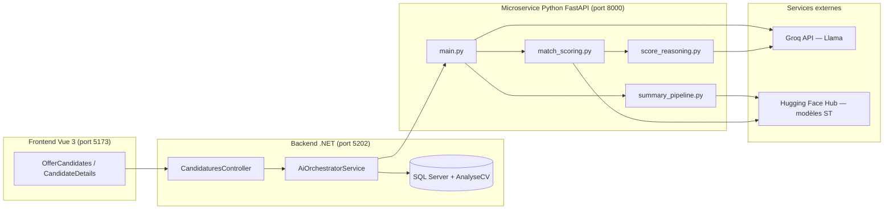
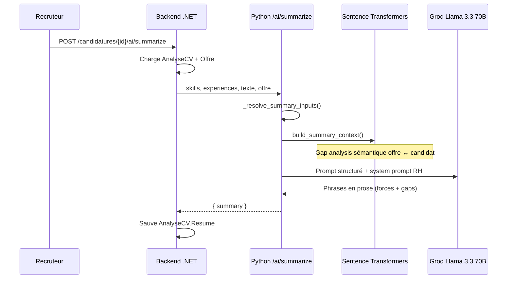
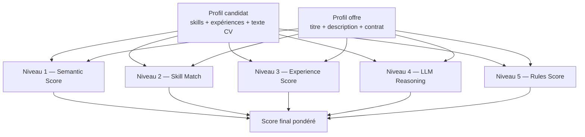
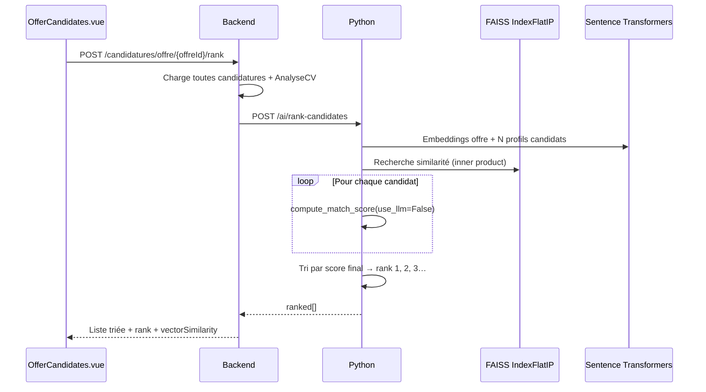

# Fiche technique — AI Summary, Score & Rank (RecruitSaaS / TalentFlow)

Document de référence sur l’analyse IA des candidatures : résumé automatique, calcul du score de matching et classement FAISS des candidatures par offre.

---

## 1. Vue d’ensemble de l’architecture



| Couche | Technologie | Rôle |
|--------|-------------|------|
| Frontend | **Vue 3 + Vite** | Affichage candidats, score, bouton « Rank by AI » |
| Backend | **ASP.NET Core + EF Core** | Orchestration, persistance, auto-refus |
| Microservice IA | **FastAPI + Uvicorn** | Extraction, résumé, score, classement |
| Embeddings | **Sentence Transformers** | Similarité sémantique multilingue |
| Vecteurs | **FAISS + ChromaDB** | Recherche rapide et persistance |
| LLM | **Groq (Llama 3.x)** | Rédaction résumé, raisonnement score, extraction CV |

---

## 2. Données en entrée (prérequis communs)

Toutes les fonctionnalités IA s’appuient sur la table **`AnalyseCV`** (backend), alimentée après upload du CV :

| Champ | Contenu |
|-------|---------|
| `TexteExtrait` | Texte brut du PDF (extraction .NET) |
| `Competences` | JSON — liste de skills (via `/ai/extract-skills`) |
| `Experience` | JSON — projets, stages, jobs (via `/ai/extract-experience`) |
| `Score` | Score final 0–100 % |
| `Resume` | Texte du résumé IA |

Le backend envoie au microservice Python : `texteExtrait`, `skills`, `experiences`, `titreOffre`, `description`, `typeContrat`, `candidatureId`, `offreId`.

---

## 3. AI Summary (résumé candidat)

### 3.1 Objectif

Produire un **briefing RH en anglais** (même si le CV est en français) qui compare le profil candidat à l’offre : forces, lacunes, rédigé en prose naturelle (sans jargon technique type « cosine », « embeddings »).

### 3.2 Chaîne de traitement



### 3.3 Fichiers clés

| Fichier | Rôle |
|---------|------|
| `recruit-ai-service/main.py` | Endpoint `POST /ai/summarize`, prompts, appel Groq |
| `recruit-ai-service/summary_pipeline.py` | Pipeline sémantique, gap analysis, fallback |
| `RecruitSaas-backend/.../AiOrchestratorService.cs` | `SummarizeCvAsync()` |

### 3.4 Pipeline sémantique (`summary_pipeline.py`)

**Modèle d’embeddings :** `paraphrase-multilingual-MiniLM-L12-v2`  
→ Vecteurs 384 dimensions, normalisés, compatibles français / anglais.

**Étapes :**

1. **Normalisation** — déduplication des skills, formatage des expériences (role, entreprise, dates, summary).
2. **Construction requête offre** — titre + description + type de contrat.
3. **Extraction des exigences** — parsing de la description (technologies, méthodologies).
4. **Gap analysis sémantique** — pour chaque exigence :
   - embedding exigence vs corpus candidat (skills + textes d’expérience),
   - seuil cosine ~ **0.55** → présent / manquant,
   - calcul `fit_score = covered / total × 100`,
   - label : `weak` (< 50 %), `partial` (50–74 %), `strong` (≥ 75 %).
5. **Contexte structuré** — skills matchés, gaps, score fit, hint pour la phrase d’ouverture.
6. **Rédaction LLM** — Groq **`llama-3.3-70b-versatile`** avec règles strictes (system prompt R1–R8).
7. **Fallback** — si Groq échoue → `compose_summary(ctx)` (texte déterministe sans LLM).

### 3.5 Structure du résumé généré

| Partie | Contenu |
|--------|---------|
| **Phrase 1 — Forces** | « The candidate's strongest relevant skills for this role include… » — compétences alignées avec l’offre, en prose |
| **Phrase 2 — Gaps** | « However, key missing skills that limit their fit include… » — technologies manquantes par rapport à l’offre |
| **Phrase 3 — Recommandation** *(selon version du prompt)* | « Based on a [weak/partial/strong] overall fit (X%)… I recommend… » — peut être désactivée |

Fonctions utilitaires dans `main.py` :

- `_resolve_summary_inputs()` — normalise skills/experiences du payload ou extrait depuis le CV si absentes.
- `_build_summary_prompt()` — construit le prompt utilisateur pour le LLM.
- `_strip_recommendation_sentence()` — supprime la phrase de recommandation si le LLM la génère malgré tout.

### 3.6 Endpoints

```
POST http://127.0.0.1:8000/ai/summarize
POST http://localhost:5202/api/candidatures/{id}/ai/summarize
```

---

## 4. Calcul du score IA (match candidat ↔ offre)

### 4.1 Objectif

Attribuer un **score global 0–100 %** (+ barres domaine / technique / expérience) pour aider le recruteur et déclencher l’**auto-refus** si le score est trop bas.

### 4.2 Architecture « 5 niveaux »

Définie dans `match_scoring.py` :



### 4.3 Formule du score final

**Avec LLM** (calcul unitaire `/ai/score`) :

```
final = 0.20 × semantic
      + 0.30 × skill
      + 0.15 × experience
      + 0.30 × llm_reasoning
      + 0.05 × rules
```

**Sans LLM** (classement bulk FAISS — plus rapide) :

```
final = 0.25 × semantic + 0.38 × skill + 0.19 × experience + 0.18 × rules
```

Le score est arrondi au **multiple de 5** le plus proche (ex. 67 → 65 ou 70).

### 4.4 Détail des 5 niveaux

| Niveau | Technologie | Logique |
|--------|-------------|---------|
| **1 — Semantic** | Sentence Transformers | Similarité cosine profil candidat ↔ profil offre |
| **2 — Skill** | Matching sémantique + règles | Exigences offre vs skills candidat ; matched / missing |
| **3 — Experience** | Embeddings par expérience | Top-5 moyenne des similarités exp ↔ offre + bonus couverture ; boost si ≥ 5 entrées sur offre de stage |
| **4 — LLM Reasoning** | Groq `llama-3.1-8b-instant` | JSON : `technical_fit`, `experience_fit`, `domain_fit`, `overall_reasoning_score` |
| **5 — Rules** | Heuristiques | Pénalités exigences manquantes, bonus couverture |

### 4.5 Domain Fit (barre « adéquation métier »)

Combinaison de :

- similarité sémantique titre/rôle vs profil,
- score LLM `domain_fit`,
- score skills,
- **pénalité seniorité** si profil junior vs offre senior,
- **boost cohérence** si titre offre + profil s’alignent (ex. stagiaire DS vs profil DS/IA),
- **cap** sur mismatch évident (ex. profil data vs offre full-stack senior).

### 4.6 Barres affichées dans l’UI

| Barre | Calcul approximatif |
|-------|---------------------|
| **Score global** | Formule pondérée ci-dessus |
| **Technical** | moyenne(skill_score, llm.technical_fit) |
| **Experience** | blend experience_score + llm.experience_fit (+ bonus portfolio) |
| **Domain fit** | blend sémantique rôle + LLM domain + skills, avec caps sur mismatch |

### 4.7 Persistance vecteurs (ChromaDB)

Après chaque score, les embeddings candidat et offre sont stockés dans **`recruit-ai-service/chroma_db/`** :

- collection `candidates`
- collection `job_offers`

→ Permet la recherche ultérieure de candidats similaires (`search_similar_candidates`).

### 4.8 Auto-refus (backend .NET)

Dans `CandidatureService.ApplyAutoDeclineIfNeededAsync` :

| Règle | Comportement |
|-------|--------------|
| Score **< 60 %** | Statut → **Refusée** |
| Exceptions | Déjà **Refusée** ou **Acceptée** → pas de changement |
| Déclencheurs | Calcul score + backfill à la lecture liste/détail candidatures |

### 4.9 Endpoints

```
POST /ai/score
POST /api/candidatures/{id}/ai/score
```

Réponse type :

```json
{
  "score": 85,
  "domainFit": 90,
  "technical": 100,
  "experience": 80,
  "statut": "Nouvelle",
  "autoDeclined": false
}
```

---

## 5. Rank des candidats (FAISS)

### 5.1 Objectif

Sur la page **« Candidates for this offer »**, classer **toutes les candidatures d’une offre** du plus au moins pertinent, avec badge de rang (#1, #2…).

### 5.2 Chaîne complète



### 5.3 Algorithme FAISS (`rank_candidates_for_offer`)

1. Construire le **profil texte** de l’offre (`build_offer_profile`).
2. Construire un **profil par candidat** (skills + expériences + extrait CV).
3. **Embedder** tous les profils → matrice NumPy normalisée.
4. **FAISS `IndexFlatIP`** — recherche par produit scalaire (= cosine similarity sur vecteurs normalisés).
5. Pour chaque candidat : **score détaillé sans LLM** (plus rapide en bulk).
6. **Tri final par `score`** (pas seulement la similarité FAISS).
7. Attribution `rank: 1, 2, 3…` et `vector_similarity`.

### 5.4 Frontend (`OfferCandidates.vue`)

| Élément | Description |
|---------|-------------|
| Bouton **Rank by AI** | Appelle `rankCandidatesForOffer(offreId)` |
| Colonne **Rank** | Badge #1, #2, #3… |
| **sim XX%** | Similarité vectorielle FAISS à côté du score |
| **Reset order** | Recharge la liste triée par date |

### 5.5 Endpoints

```
POST /ai/rank-candidates
POST /api/candidatures/offre/{offreId}/rank
```

Réponse enrichie (`RankedCandidatureResponseDto`) :

- `rank`, `faissScore`, `vectorSimilarity`
- `domainFit`, `technical`, `experience`
- Infos candidat : nom, email, statut, scoreIA, etc.

---

## 6. Extraction CV (amont indispensable)

Avant summary / score / rank, le CV doit être analysé :

| Endpoint Python | Modèle Groq | Sortie |
|-----------------|-------------|--------|
| `/ai/extract-skills` | llama-3.1-8b-instant | `{ skills: [...] }` |
| `/ai/extract-experience` | llama-3.1-8b-instant | `{ experiences: [...] }` |
| `/ai/extract-certifications` | llama-3.1-8b-instant | certifications |

Extraction PDF côté **.NET** (`CvExtractionService`) → `TexteExtrait` dans `AnalyseCV`.

---

## 7. Stack technique récapitulative

| Composant | Package / service | Usage |
|-----------|-------------------|-------|
| API IA | **FastAPI** | Routes REST `/ai/*` |
| Serveur | **Uvicorn** | Dev port 8000, hot reload |
| Embeddings | **sentence-transformers** | `paraphrase-multilingual-MiniLM-L12-v2` |
| Calcul vectoriel | **NumPy** | Cosine, moyennes, matrices |
| Index recherche | **FAISS** (`IndexFlatIP`) | Classement bulk candidats |
| Base vecteurs | **ChromaDB** | Persistance embeddings candidats/offres |
| LLM rapide | **Groq** — `llama-3.1-8b-instant` | Score reasoning, extraction CV |
| LLM qualité | **Groq** — `llama-3.3-70b-versatile` | Résumé RH narratif |
| Modèles HF | **Hugging Face Hub** | Téléchargement poids Sentence Transformers |
| Orchestration | **ASP.NET Core** | `AiOrchestratorService` |
| Frontend | **Vue 3 + axios** | `candidatureService.js`, `OfferCandidates.vue` |

---

## 8. Cartographie des fichiers

```
appliPFE26/
├── docs/
│   └── FICHE-IA-SUMMARY-SCORE-RANK.md    ← ce document
├── recruit-ai-service/
│   ├── main.py              → Endpoints, Groq, orchestration
│   ├── summary_pipeline.py  → Résumé : gaps sémantiques, contexte LLM
│   ├── match_scoring.py     → Score 5 niveaux + rank FAISS + Chroma
│   ├── score_reasoning.py   → Niveau 4 LLM reasoning
│   ├── chroma_db/           → Vecteurs persistés
│   └── .env                 → GROQ_API_KEY, CHROMA_PATH
├── RecruitSaas-backend/Recrutement-api/
│   ├── Services/AI/AiOrchestratorService.cs
│   ├── Services/TenantServices/CandidatureService.cs
│   ├── Controllers/CandidaturesController.cs
│   └── DTOs/Candidature/RankedCandidatureResponseDto.cs
└── RecruitSaas-frontend/
    ├── src/services/candidatureService.js
    └── src/views/recruiter/OfferCandidates.vue
```

---

## 9. Configuration et démarrage

| Service | Commande | Port |
|---------|----------|------|
| Python IA | `python -m uvicorn main:app --reload` | 8000 |
| Backend | `dotnet run` | 5202 |
| Frontend | `npm run dev` | 5173 |

**Variables d’environnement** (`recruit-ai-service/.env`) :

| Variable | Obligatoire | Description |
|----------|-------------|-------------|
| `GROQ_API_KEY` | Oui | Clé API Groq pour Llama |
| `CHROMA_PATH` | Non | Chemin base ChromaDB (défaut `./chroma_db`) |
| `HF_TOKEN` | Non | Token Hugging Face (limites de téléchargement plus élevées) |

---

## 10. Parcours recruteur (exemple)

1. Candidat postule → CV extrait → skills + expériences stockés en base.
2. **Calculate score** → score 85 %, barres domain / tech / expérience.
3. **Summarize** → briefing RH EN : forces + gaps par rapport à l’offre.
4. Page offre → **Rank by AI** → candidats triés #1, #2… avec similarité FAISS.
5. Si score **< 60 %** → statut **Refusée** automatiquement.

---

## 11. Résumé des endpoints API

| Action | Backend (.NET) | Python (FastAPI) |
|--------|----------------|------------------|
| Extraire skills | `POST /api/candidatures/{id}/ai/extract-skills` | `POST /ai/extract-skills` |
| Extraire expériences | `POST /api/candidatures/{id}/ai/extract-experience` | `POST /ai/extract-experience` |
| Calculer score | `POST /api/candidatures/{id}/ai/score` | `POST /ai/score` |
| Générer résumé | `POST /api/candidatures/{id}/ai/summarize` | `POST /ai/summarize` |
| Classer candidats (offre) | `POST /api/candidatures/offre/{offreId}/rank` | `POST /ai/rank-candidates` |

---

*Document généré pour le projet PFE RecruitSaaS — TalentFlow.*
