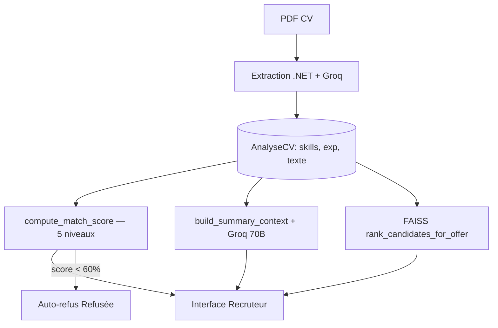

# Captures pour présentation PFE — Pipeline IA RecruitSaaS

> **Comment utiliser ce document**  
> Ouvrez chaque section dans Cursor (fichier source indiqué), zoomez sur le bloc de code, faites une capture d’écran, puis copiez le texte **« À dire à l’oral »** sous la slide.

---

## SLIDE 1 — Modèle d’embeddings (base commune Score + Summary + Rank)

**Fichier :** `recruit-ai-service/summary_pipeline.py`  
**Technologie :** Sentence Transformers — Hugging Face

```python
_embedder = None

def _get_embedder():
    global _embedder
    if _embedder is None:
        from sentence_transformers import SentenceTransformer
        _embedder = SentenceTransformer("paraphrase-multilingual-MiniLM-L12-v2")
    return _embedder
```

**À dire à l’oral :**  
Ce modèle transforme le texte (CV, offre, compétences) en **vecteurs numériques** de 384 dimensions. Il est **multilingue** (français + anglais). Il est chargé **une seule fois** (singleton) et réutilisé pour le score, le résumé et le classement FAISS. La similarité cosine entre deux vecteurs mesure la **proximité sémantique** entre candidat et offre.

---

## SLIDE 2 — Étape 0 : Extraction des compétences (CV → JSON)

**Fichier :** `recruit-ai-service/main.py`  
**Technologie :** Groq — `llama-3.1-8b-instant`

```python
@app.post("/ai/extract-skills")
def extract_skills(req: CvRequest):
    check_texte(req.texteExtrait, "/ai/extract-skills")
    cv = prepare_cv(req.texteExtrait)
    prompt = f"""CV parser. Words may be concatenated — separate them intelligently.
Extract ALL technical skills, tools, and technologies mentioned. Max 20.

Respond ONLY: {{"skills": ["skill1", "skill2", ...]}}

CV: {cv}"""
    raw = call_groq(prompt, max_tokens=400, model=MODEL_FAST)
    result = parse_json(raw)
    result["skills"] = _dedupe_skills(result["skills"])
    return result
```

**À dire à l’oral :**  
Le texte du CV (extrait du PDF côté .NET) est envoyé au **LLM Groq**. Il retourne une liste JSON de compétences (`Python`, `React`, etc.) stockée dans `AnalyseCV.Competences`. C’est la **matière première** pour le score et le résumé.

---

## SLIDE 3 — Étape 0 : Extraction des expériences (CV → JSON)

**Fichier :** `recruit-ai-service/main.py`  
**Technologie :** Groq — `llama-3.1-8b-instant`

```python
@app.post("/ai/extract-experience")
def extract_experience(req: CvRequest):
    check_texte(req.texteExtrait, "/ai/extract-experience")
    cv = prepare_cv(req.texteExtrait)
    # Prompt : jobs, stages ET projets académiques/personnels
    raw = call_groq(prompt, max_tokens=800, model=MODEL_FAST)
    result = parse_json(raw)
    return {"experiences": result.get("experiences", [])}
```

**Chaque expérience :**

```json
{
  "role": "Stagiaire Data Scientist",
  "entreprise": "ESPRIT",
  "years": "2024",
  "summary": "Projet NLP avec Python et scikit-learn"
}
```

**À dire à l’oral :**  
On extrait aussi les **stages, emplois et projets**. Ces entrées alimentent le score **expérience** et le résumé RH (forces / lacunes).

---

## SLIDE 4 — Score IA : endpoint API

**Fichier :** `recruit-ai-service/main.py`  
**Route :** `POST /ai/score`

```python
@app.post("/ai/score")
def score(req: EvalRequest):
    check_texte(req.texteExtrait, "/ai/score")
    skills, experiences = _resolve_summary_inputs(req)
    return compute_match_score(
        cv_text=req.texteExtrait,
        skills=skills,
        experiences=experiences,
        titre_offre=req.titreOffre,
        description=req.description,
        type_contrat=req.typeContrat,
        candidate_id=req.candidatureId,
        offer_id=req.offreId,
    )
```

**À dire à l’oral :**  
Le backend .NET appelle cet endpoint après avoir récupéré le CV, l’offre et les données extraites. La fonction centrale est **`compute_match_score`** dans `match_scoring.py`.

---

## SLIDE 5 — Score : architecture 5 niveaux (vue d’ensemble)

**Fichier :** `recruit-ai-service/match_scoring.py`

```python
"""
Architecture 5 niveaux :

  1. Semantic Score      (Sentence Transformers)
  2. Skill Match Score   (exigences offre vs skills candidat)
  3. Experience Score    (projets / stages / profondeur)
  4. LLM Reasoning Score (Groq / Llama)
  5. Rule-Based Score    (pénalités / bonus)

  final_score =
    0.20 × semantic +
    0.30 × skill +
    0.15 × experience +
    0.30 × llm_reasoning +
    0.05 × rules
"""
```

**À dire à l’oral :**  
Le score n’est pas une seule similarité : c’est une **combinaison pondérée** de 5 analyses complémentaires — sémantique, compétences, expérience, raisonnement LLM et règles métier.

---

## SLIDE 6 — Score Niveau 1 : Similarité sémantique globale

**Fichier :** `recruit-ai-service/match_scoring.py`  
**Technologie :** MiniLM + NumPy (cosine)

```python
cand_text = build_candidate_profile(skill_list, exp_list, cv_text)
offer_text = build_offer_profile(titre_offre, description, type_contrat)

cand_emb = _embed_one(cand_text)   # vecteur candidat
offer_emb = _embed_one(offer_text) # vecteur offre

# Niveau 1 — Semantic
semantic_raw = _semantic_match_score(cand_emb, offer_emb)
semantic_score = _round_to_5(semantic_raw * 100)
```

**À dire à l’oral :**  
On construit un **profil texte** candidat et offre, on les vectorise avec MiniLM, puis on calcule la **similarité cosine** (0 à 1 → 0 à 100 %). C’est la vue d’ensemble « est-ce que ce profil ressemble à cette offre ? ».

---

## SLIDE 7 — Score Niveau 2 : Matching des compétences

**Fichier :** `recruit-ai-service/match_scoring.py` + `summary_pipeline.py`  
**Technologie :** MiniLM (gap analysis sémantique)

```python
ctx = build_summary_context(
    skills=skill_list,
    experiences=exp_list,
    titre_offre=titre_offre,
    description=description,
    type_contrat=type_contrat,
)
skill_gaps = ctx.get("skill_gaps")  # present, missing, fit_score

skill_score, matched_skills, missing_skills = _skill_match_score(skill_gaps)
```

**À dire à l’oral :**  
On parse les **exigences de l’offre** (technologies dans la description). Pour chaque exigence, on compare sémantiquement avec les skills + expériences du candidat. On obtient : compétences **matchées**, **manquantes**, et un `fit_score` (% d’exigences couvertes).

---

## SLIDE 8 — Score Niveau 3 : Score expérience

**Fichier :** `recruit-ai-service/match_scoring.py`  
**Technologie :** MiniLM (similarité par expérience/projet)

```python
def _experience_semantic_score(offer_emb, experiences, cv_text):
    # Chaque stage / projet → embedding
    exp_embs = _embed_texts(texts)
    sims = sorted((exp_embs @ offer_emb).tolist(), reverse=True)
    top_mean = mean(sims[:5])           # top 5 expériences
    coverage_bonus = ...                # bonus si plusieurs exp. pertinentes
    return blended + coverage_bonus
```

**À dire à l’oral :**  
Chaque **stage, job ou projet** est comparé à l’offre. On prend la **moyenne des 5 meilleures** similarités + un bonus si le candidat a **plusieurs expériences pertinentes** (important pour les profils étudiants avec plusieurs projets IA).

---

## SLIDE 9 — Score Niveau 4 : Raisonnement LLM

**Fichier :** `recruit-ai-service/score_reasoning.py`  
**Technologie :** Groq — `llama-3.1-8b-instant`

```python
def fetch_llm_reasoning_score(...):
    prompt = f"""Evaluate how well this candidate matches the job offer.

JOB: {titre_offre} — {description[:1200]}
CANDIDATE PROFILE: {candidate_profile[:2000]}
SKILL MATCH ANALYSIS: {skill_summary}

Respond with JSON only:
{{
  "technical_fit": <0-100>,
  "experience_fit": <0-100>,
  "domain_fit": <0-100>,
  "overall_reasoning_score": <0-100>,
  "reasoning": "..."
}}"""
    response = _get_client().chat.completions.create(model=_MODEL, ...)
```

**À dire à l’oral :**  
Le LLM reçoit le profil candidat, l’offre et les signaux automatiques (sémantique, skills, expérience). Il renvoie un JSON avec **technical_fit**, **experience_fit**, **domain_fit** et un score global de raisonnement. Il gère les cas nuancés (ex. stagiaire DS vs offre DS).

---

## SLIDE 10 — Score Niveau 5 : Règles métier

**Fichier :** `recruit-ai-service/match_scoring.py`

```python
def _rules_score(skill_gaps, skill_list, description):
    score = 100.0
    for req in missing:
        if _is_hard_requirement(req, description):
            score -= 20   # pénalité forte
        else:
            score -= 10   # pénalité légère
    if coverage_ratio >= 0.75:
        score += 10       # bonus bonne couverture
    return _round_to_5(score)
```

**À dire à l’oral :**  
Couche **déterministe** : pénalités si une compétence **obligatoire** manque, bonus si le candidat couvre **≥ 75 %** des exigences. Ça stabilise le score quand le LLM ou la sémantique sont trop optimistes.

---

## SLIDE 11 — Score final : formule pondérée

**Fichier :** `recruit-ai-service/match_scoring.py`

```python
_WEIGHTS_WITH_LLM = {
    "semantic": 0.20,
    "skill": 0.30,
    "experience": 0.15,
    "llm": 0.30,
    "rules": 0.05,
}

final_raw = (
    w["semantic"] * semantic_score
    + w["skill"] * skill_score
    + w["experience"] * experience_score
    + w["llm"] * llm_overall
    + w["rules"] * rules_score
)
score = _round_to_5(final_raw)  # arrondi au multiple de 5
```

**À dire à l’oral :**  
Les 5 niveaux sont **fusionnés avec des poids fixes**. Le skill (30 %) et le LLM (30 %) comptent le plus. Le score affiché est arrondi au **5 %** près (ex. 67 → 65 ou 70).

---

## SLIDE 12 — Persistance vecteurs (ChromaDB)

**Fichier :** `recruit-ai-service/match_scoring.py`  
**Technologie :** ChromaDB

```python
_chroma_client = chromadb.PersistentClient(path=_CHROMA_PATH)
_candidate_collection = _chroma_client.get_or_create_collection(
    name="candidates",
    metadata={"hnsw:space": "cosine"},
)
_offer_collection = _chroma_client.get_or_create_collection(
    name="job_offers",
    metadata={"hnsw:space": "cosine"},
)
# Après chaque score : upsert embedding candidat + offre
```

**À dire à l’oral :**  
Les embeddings sont **sauvegardés localement** dans `chroma_db/`. Ça permet de retrouver plus tard des candidats similaires à une offre sans recalculer tous les vecteurs.

---

## SLIDE 13 — Auto-refus si score < 60 %

**Fichier :** `RecruitSaas-backend/.../CandidatureService.cs`  
**Technologie :** ASP.NET Core + EF Core

```csharp
/// Score IA < 60 % → statut Refusée (sauf Acceptée / déjà Refusée).
public async Task<(string Statut, bool AutoDeclined)> ApplyAutoDeclineIfNeededAsync(
    Guid candidatureId, float score)
{
    if (!ShouldAutoDecline(score, candidature.Statut))
        return (candidature.Statut, false);

    candidature.Statut = "Refusée";
    await _context.SaveChangesAsync();
    return ("Refusée", true);
}
```

**À dire à l’oral :**  
Après le calcul du score, le backend .NET applique une **règle automatique** : en dessous de **60 %**, la candidature passe en **Refusée**, sauf si elle est déjà acceptée ou refusée manuellement.

---

## SLIDE 14 — AI Summary : pipeline

**Fichier :** `recruit-ai-service/summary_pipeline.py`  
**Technologie :** MiniLM + Groq `llama-3.3-70b-versatile`

```python
def build_summary_context(skills, experiences, titre_offre, description, ...):
    skill_gaps = _analyze_skill_gaps_semantic(
        skill_list, job_query,
        experiences=exp_list,
        titre=titre_offre,
        description=description,
    )
    return {
        "skill_gaps": skill_gaps,      # present / missing / fit_score
        "has_offer": has_offer,
        "offer_title": titre_offre,
        "features": features,          # skills, dernière expérience, langue CV
    }
```

**À dire à l’oral :**  
Avant d’appeler le LLM, on prépare un **contexte structuré** : compétences matchées, lacunes, score fit. Le résumé est basé sur des **faits calculés**, pas sur une relecture brute du PDF.

---

## SLIDE 15 — AI Summary : endpoint + rédaction LLM

**Fichier :** `recruit-ai-service/main.py`  
**Route :** `POST /ai/summarize`

```python
@app.post("/ai/summarize")
def summarize(req: EvalRequest):
    skills, experiences = _resolve_summary_inputs(req)
    ctx = build_summary_context(
        skills=skills, experiences=experiences,
        titre_offre=req.titreOffre, description=req.description,
    )
    prompt = _build_summary_prompt(..., ctx=ctx, skills=skills, ...)
    raw = call_groq(
        prompt,
        max_tokens=450,
        model=MODEL_LARGE,          # llama-3.3-70b-versatile
        system=_SUMMARY_SYSTEM_EN,
    )
    return {"summary": summary}
```

**Format du résumé (anglais) :**

1. *The candidate's strongest relevant skills for this role include…*  
2. *However, key missing skills that limit their fit include…*

**À dire à l’oral :**  
Le LLM **rédige en prose** un briefing RH en **anglais**, en s’appuyant sur le gap analysis. Si Groq échoue, un fallback **`compose_summary`** génère le texte sans LLM.

---

## SLIDE 16 — Rank candidats : FAISS

**Fichier :** `recruit-ai-service/match_scoring.py`  
**Technologie :** FAISS + MiniLM

```python
def rank_candidates_for_offer(titre_offre, description, candidates, ...):
    offer_emb = _embed_one(build_offer_profile(...))

    for c in candidates:
        profile = build_candidate_profile(skills, exps, cv)
        profiles.append(profile)

    cand_embs = _embed_texts(profiles)

    index = faiss.IndexFlatIP(dim)   # Inner Product = cosine si normalisé
    index.add(cand_embs)
    similarities, indices = index.search(offer_emb.reshape(1, -1), k)

    for each candidate:
        detail = compute_match_score(..., use_llm=False)  # rapide, sans Groq

    results.sort(key=lambda x: x["score"], reverse=True)
    r["rank"] = 1, 2, 3...
```

**À dire à l’oral :**  
Pour **toute une offre**, on vectorise tous les candidats, **FAISS** trouve les plus proches sémantiquement, puis on recalcule un **score détaillé sans LLM** (plus rapide). Tri final par score → **#1, #2, #3** dans l’interface « Rank by AI ».

---

## SLIDE 17 — Rank : chaîne Frontend → Backend

**Frontend :** `RecruitSaas-frontend/src/views/recruiter/OfferCandidates.vue`

```javascript
export const rankCandidatesForOffer = (offreId) =>
  api.post(`/candidatures/offre/${offreId}/rank`)
```

**Backend :** `POST /api/candidatures/offre/{offreId}/rank`  
→ `AiOrchestratorService.RankCandidaturesForOffreAsync`  
→ `POST http://127.0.0.1:8000/ai/rank-candidates`

**À dire à l’oral :**  
Le recruteur clique **« Rank by AI »** sur la page candidatures d’une offre. Le backend charge toutes les candidatures, appelle Python, et renvoie la liste triée avec **rank**, **score**, **vectorSimilarity**.

---

## SLIDE 18 — Stack technique (slide récap)

| Composant | Technologie | Usage |
|-----------|-------------|-------|
| Embeddings | **Sentence Transformers** — `paraphrase-multilingual-MiniLM-L12-v2` | Score, Summary, Rank |
| Vecteurs | **NumPy** | Cosine, matrices |
| Recherche | **FAISS** `IndexFlatIP` | Classement bulk |
| Stockage | **ChromaDB** | Persistance embeddings |
| LLM rapide | **Groq** — `llama-3.1-8b-instant` | Extraction CV, score reasoning |
| LLM qualité | **Groq** — `llama-3.3-70b-versatile` | Résumé RH |
| API IA | **FastAPI + Uvicorn** | Port 8000 |
| Orchestration | **ASP.NET Core** | Pont UI ↔ Python ↔ SQL |
| Frontend | **Vue 3 + Vite** | TalentFlow |

---

## SLIDE 19 — Schéma global (à dessiner ou Mermaid)



---

*Document pour captures d’écran — Projet PFE RecruitSaaS / TalentFlow*
